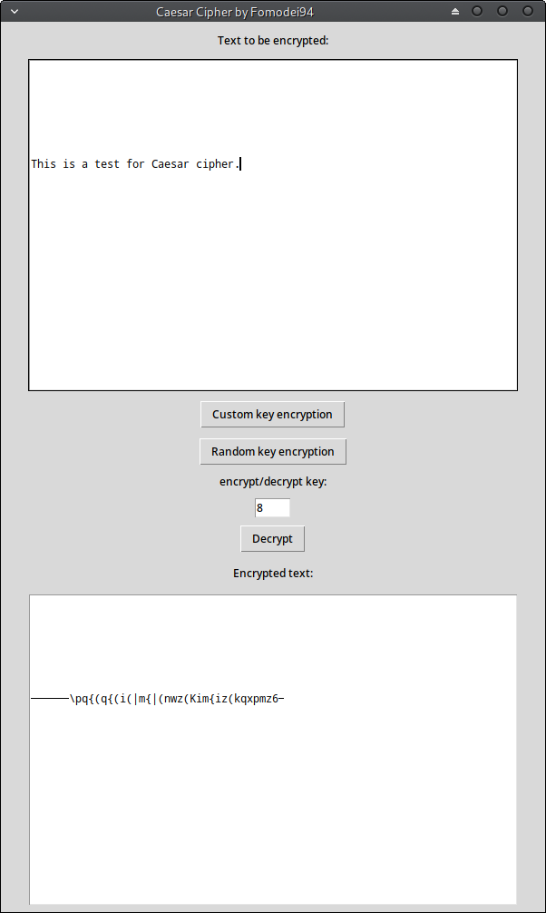

# Caesar Cipher

My own python implementation of _Caesar Cipher_, one of the most
basic encryption technique. 

Based on characters substitution 

[HERE](https://en.wikipedia.org/wiki/Caesar_cipher)

