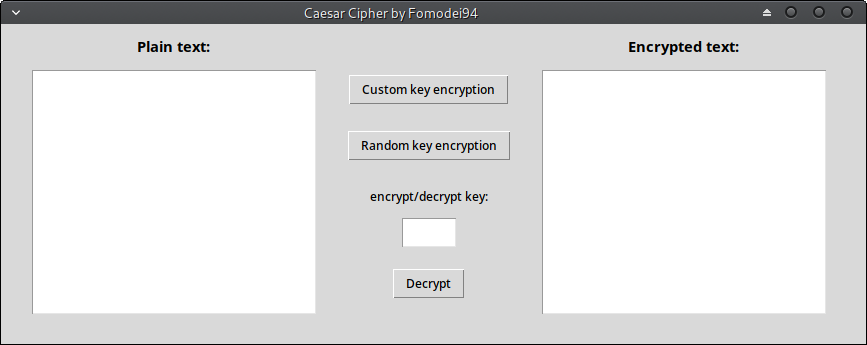

# Caesar Cipher

My own python implementation of _Caesar Cipher_, one of the most
basic encryption technique. 

Based on characters substitution, shifting characters by the key value.

For more infos about Caesar Cipher's functioning, click
[HERE](https://en.wikipedia.org/wiki/Caesar_cipher).

_Gui window screenshot:_

## Features

- Encrypt plain text with your own custom key.

- Encrypt plain text with a randomly generated key.

- Decrypt encrypted text with given key.

- Very long text management, text boxes allow vertical scrolling.

## Contact me

If you have any suggestion/problem/question please email me or open a Github issue.

| Name | Github profile | Email |
|------|----------------|-------|
|Federico Omodei | http://github.com/Fomodei94 | federico[at]fomodei.com
|-----------|Alternative mail address: | federico.omodei[at]gmail.com